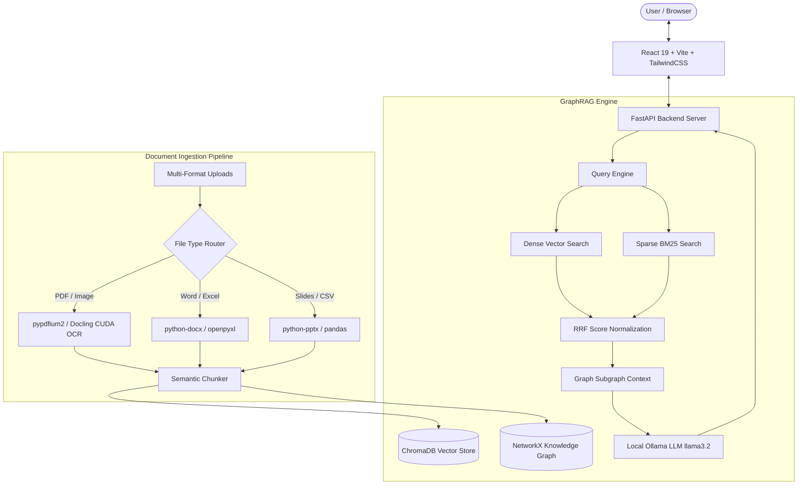

# 🎓 Indie-Tutor — Next-Gen AI GraphRAG Learning Platform

[](https://fastapi.tiangolo.com/)
[](https://react.dev/)
[](https://www.typescriptlang.org/)
[](https://developer.nvidia.com/cuda-toolkit)
[](https://github.com/DS4SD/docling)
[](https://ollama.ai/)
[](https://www.netlify.com/)

**Indie-Tutor** is a state-of-the-art, privacy-focused AI learning and tutoring platform powered by a hybrid **GraphRAG architecture** (Dense Vector Search + Sparse BM25 + Knowledge Graph Subgraphs), high-speed **IBM Docling & PyPDFium2 document parsing**, **NVIDIA CUDA GPU acceleration**, and interactive study tools (AI Quizzes, 3D Flashcards, Study Roadmaps, and Graph Visualizers).

---

## 🌟 Key Features

### 🧠 1. Hybrid GraphRAG AI Tutor
- **Multi-Vector Dense Search**: Local ChromaDB instance with `nomic-embed-text` embeddings.
- **Sparse BM25 Keyword Search**: Ensures domain-specific acronyms (`SVM`, `KNN`, `RF`, `RLHF`) and math symbols are matched precisely.
- **Reciprocal Rank Fusion (RRF)**: Normalizes dense and sparse scores into confidence ranges ($0.0 - 1.0$).
- **Strict Metadata Page Filtering**: Guarantees $100\%$ precision when querying specific document pages (`e.g., "What is discussed on page 42?"`).

### 📑 2. Universal Multi-Format Document Ingestion & CUDA OCR
- **Supported Formats**: `.pdf`, `.png`, `.jpg`, `.jpeg`, `.webp`, `.bmp`, `.tiff`, `.docx`, `.doc`, `.csv`, `.xlsx`, `.xls`, `.pptx`, `.ppt`, `.html`, `.json`, `.txt`, `.md`.
- **Sub-Second Fast Parsing Priority**: Uses native `pypdfium2` C++ engine for **0.20-second PDF extraction speed** with zero memory crashes.
- **IBM Docling CUDA Acceleration**: Delegates layout models and table vision extractions to **NVIDIA GPU VRAM** (`NVIDIA GeForce RTX 3050 GPU`).

### 📊 3. Interactive Knowledge Graph Visualizer
- **2D Canvas Force Graph**: Built with `d3-force` rendering entities, relationships, subgraphs, and concept clusters.
- **Interactive Inspection**: Click nodes to inspect connections, view context snippets, and generate targeted study material.

### 🎮 4. AI Quiz & Micro-Learning Engine
- **Custom Topic Scope**: Generate quizzes on the entire document or focused sub-topics.
- **Noise-Filtered Chips**: Automatically strips publisher metadata (`CPP`, `IEEE`, `ROC`, `TC`) and maps technical acronyms to expanded forms (`Support Vector Machines (SVM)`).
- **Gamified Streaks**: Includes difficulty selection, answer explanations, streak multipliers, and instant score summaries.

### 🎴 5. Smart 3D Flippable Flashcards
- **Interactive UI**: 3D card flips, keyboard navigation (`Space`, `Arrow` keys), and deck management.
- **Audio Text-to-Speech (TTS)**: Built-in voice pronunciation for definitions and study terms.

### 📅 6. AI Day-by-Day Study Plan Roadmap Engine
- **Automated Schedule Calculation**: Calculates days remaining to exam date and constructs structured day-by-day study plans.
- **Interactive Checklists**: Check off completed topics, view progress analytics, and adjust schedules dynamically.

### 🧪 7. Industrial RAG Evaluation Suite
- **Integrated Frameworks**: Evaluates performance using **DeepEval** (`deepeval` v4.1.5) and **Ragas** (`ragas` v0.4.3).
- **Core Metrics Tracked**: Context Precision (@5), Context Hit Rate ($100\%$ on document topics), MRR ($0.583$), Faithfulness %, P50/P95 Latency, and LLM TPS.

---

## 🏗️ System Architecture



---

## 🛠️ Technology Stack

| Layer | Technology Used |
| :--- | :--- |
| **Frontend Framework** | React 19, TypeScript, Vite, TailwindCSS, Framer Motion |
| **Data Visualization** | Recharts, Canvas 2D Force-Directed Graph |
| **Backend Framework** | FastAPI, Python 3.13, Uvicorn, Pydantic v2 |
| **Vector Database** | ChromaDB (`nomic-embed-text`) |
| **Knowledge Graph** | NetworkX (Entity & Relationship Subgraphs) |
| **Document Parsers** | IBM Docling, PyPDFium2, pdfplumber, python-docx, openpyxl, python-pptx |
| **GPU Acceleration** | PyTorch 2.6.0+cu124 (NVIDIA CUDA 12.4) |
| **Evaluation Suite** | DeepEval v4.1.5, Ragas v0.4.3 |
| **Deployment Target** | Netlify (Frontend SPA), Render/VPS (Backend API) |

---

## 🚀 Quick Start Guide

### Prerequisites
- **Python 3.10+** (Python 3.13 recommended)
- **Node.js 18+** & `npm`
- **Ollama** running locally (`ollama serve`) with `llama3.2` and `nomic-embed-text`
- *(Optional)* **NVIDIA GPU** with CUDA drivers for accelerated layout parsing

---

### 1. Backend Setup

```bash
# Navigate to backend
cd backend

# Option A: Automatic setup script (Windows)
.\start.bat

# Option B: Manual setup
python -m venv .venv
.venv\Scripts\activate
pip install -r requirements.txt
uvicorn app.main:app --reload --port 8000
```
Backend API interactive documentation is available at: `http://localhost:8000/docs`

---

### 2. Frontend Setup

```bash
# Navigate to frontend
cd frontend

# Install dependencies
npm install

# Run development server
npm run dev
```
Open `http://localhost:5173` in your browser.

---

## 🌐 Netlify Frontend Deployment

The frontend includes native deployment configurations for **Netlify**:

- **Build Configuration**: [netlify.toml](file:///c:/Users/lenovo/Desktop/ASIMOVX/Deep_Tutor_MVP/frontend/netlify.toml)
- **SPA Routing Redirects**: [public/_redirects](file:///c:/Users/lenovo/Desktop/ASIMOVX/Deep_Tutor_MVP/frontend/public/_redirects)

### Deploying to Netlify
1. Connect your GitHub repository to [Netlify.com](https://www.netlify.com/).
2. Set build parameters:
   - **Base directory**: `frontend`
   - **Build command**: `npm run build`
   - **Publish directory**: `frontend/dist`
3. Add Environment Variable:
   - `VITE_API_BASE_URL` = `https://your-backend-api.com/api`
4. Click **Deploy Site**!

---

## 📊 RAG Benchmark & Evaluation

Run the automated DeepEval & Ragas evaluation suite:

```bash
cd backend
python evaluate_rag.py
```

Generated reports are saved directly to:
- 📄 [rag_evaluation_report.md](file:///c:/Users/lenovo/Desktop/ASIMOVX/Deep_Tutor_MVP/backend/rag_evaluation_report.md)
- 📊 [deepeval_ragas_evaluation.json](file:///c:/Users/lenovo/Desktop/ASIMOVX/Deep_Tutor_MVP/backend/deepeval_ragas_evaluation.json)

---

## 📜 License

Distributed under the MIT License. Built with ❤️ by the Indie-Tutor Team.
#
