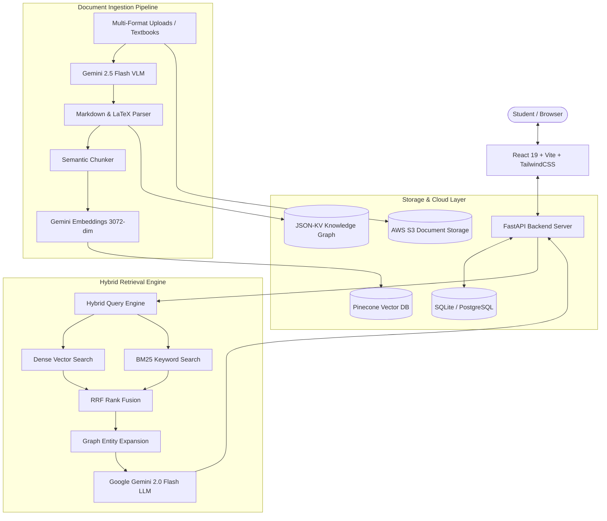

# 🎓 DeepTutor — Multimodal AI GraphRAG Learning Platform

[](https://fastapi.tiangolo.com/)
[](https://react.dev/)
[](https://www.typescriptlang.org/)
[](https://aistudio.google.com/)
[](https://www.pinecone.io/)
[](https://www.docker.com/)

**DeepTutor** is a state-of-the-art, multimodal AI tutoring and learning platform. Powered by **Hybrid GraphRAG** (Dense 3072-dim Vector Search + Sparse BM25 + Knowledge Graph Subgraphs), **Google Gemini 2.0/2.5 Flash VLM** (Vision-Language Model) for high-fidelity diagram, table, and LaTeX extraction, **Pinecone Cloud Vector Store**, and an interactive suite of study tools (3D Knowledge Graph, AI Quizzes, Smart Flashcards, Day-by-Day Exam Roadmaps, and 5-Minute Cheatcodes).

---

## 🚀 Cloud Deployment Guide

👉 **For complete cloud deployment instructions (Render, Railway, Docker, AWS EC2, Vercel), see [CLOUD_DEPLOYMENT.md](file:///c:/Users/lenovo/Desktop/ASIMOVX/DeepTutor/CLOUD_DEPLOYMENT.md).**

---

## 🌟 Key Features

### 🧠 1. Multimodal Hybrid GraphRAG AI Tutor
- **3072-Dimension Dense Vector Retrieval**: Uses Google Gemini `models/text-embedding-004` indexed into Pinecone Serverless vector database.
- **Sparse BM25 + Acronym Expansion**: Resolves 35+ technical and curriculum abbreviations (`SVM`, `KNN`, `PCA`, `CNN`, `RNN`, `BERT`, `DNA`, `SCERT`) automatically.
- **Comparative Query Decomposition**: Decomposes multi-concept comparison questions (`"difference between KNN and SVM"`) into dual concept searches with structured side-by-side comparison tables.
- **Sub-Second Streaming (SSE)**: Real-time token streaming with citation badges, confidence scores, and visual source cards.

### 👁️ 2. Vision-Language Model (VLM) Textbook Ingestion
- **Complete Diagram & Schematic Understanding**: Transcribes ray optics, circuit schematics, biological diagrams, and charts into structured pedagogical descriptions.
- **LaTeX Math & Chemical Equations**: Extracted natively into standard LaTeX (`$...$` for inline, `$$...$$` for block displays).
- **Automated Table Extraction**: Converts complex textbook tables into structured Markdown tables.
- **Pre-Indexed SSLC Textbooks**: Includes Physics, Chemistry, and Mathematics Class 10 full curriculum.

### 🌐 3. Interactive 3D Knowledge Graph
- **Force-Directed Visual Canvas**: Explores document concept nodes and semantic relationships in real time.
- **Smart Directive Sanitizer**: Strips question boilerplate (`"Explain:"`, `"Write a note on:"`, `"Give reasons"`) to surface only high-yield academic concepts.
- **Cross-Concept Traversal**: Click any node to view definitions, related entities, and study context.

### 🎮 4. Gamified AI Study Tools
- **⚡ 5-Minute Cheatcodes**: Instant 6-section structured revision sheets with simple analogies and key formulas.
- **🏆 Gamified Quizzes**: AI-generated multiple-choice questions with XP scoring, instant feedback, and streak multipliers.
- **🎴 Smart 3D Flashcards**: Flippable study decks with keyboard shortcuts and built-in Text-to-Speech (TTS) pronunciation.
- **📅 AI Day-by-Day Exam Roadmaps**: Dynamic exam countdown schedules with interactive topic checklists.

---

## 🏗️ System Architecture



---

## 🛠️ Technology Stack

| Layer | Technology |
| :--- | :--- |
| **Frontend** | React 19, TypeScript, Vite, TailwindCSS, Lucide Icons, Framer Motion |
| **Backend** | FastAPI, Python 3.11+, Uvicorn, Gunicorn, Pydantic v2 |
| **LLM & VLM** | Google Gemini 2.0 Flash, Gemini 2.5 Flash (Vision) |
| **Vector Database** | Pinecone Serverless (3072 dimensions, Cosine) |
| **Embeddings** | Google Gemini `models/text-embedding-004` |
| **Knowledge Graph** | JSON-KV Store / LightRAG dual store |
| **Document Processing** | PyMuPDF (fitz), pdfplumber, python-docx, pypdfium2 |
| **Cloud & Storage** | AWS S3, Docker, Docker Compose, Nginx |

---

## ⚡ Quick Start (Local Development)

### 1. Backend Setup
```bash
cd backend

# Option A: Windows 1-Click Startup
.\start.bat

# Option B: Manual Setup
python -m venv .venv
# On Windows: .venv\Scripts\activate | On Linux/macOS: source .venv/bin/activate
pip install -r requirements.txt

# Configure your .env file
cp .env.example .env
# Fill in GEMINI_API_KEY and PINECONE_API_KEY in .env

# Run FastAPI server
uvicorn app.main:app --reload --port 8000
```
Interactive API documentation: `http://localhost:8000/docs`

---

### 2. Frontend Setup
```bash
cd frontend
npm install
npm run dev
```
Open `http://localhost:5173` in your browser.

---

### 3. Ingest Textbooks via VLM
```bash
cd backend
python scripts/ingest_textbooks_vlm.py --subject all --concurrency 5 --dpi 180
```

---

## 🐳 Docker Deployment

Run both frontend and backend in production containers:

```bash
# Set your environment variables in .env in project root
docker compose up --build -d
```
Access the application at `http://localhost`.

For full production cloud deployment steps, see **[CLOUD_DEPLOYMENT.md](file:///c:/Users/lenovo/Desktop/ASIMOVX/DeepTutor/CLOUD_DEPLOYMENT.md)**.
